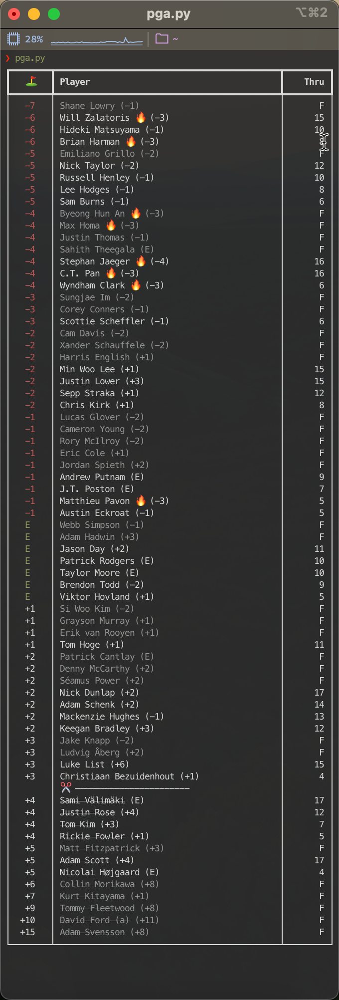

# pga-cli

Fun little script to get the latest PGA scores from the ESPN website and display them in your terminal.



## Setup

Clone this repository and then cd into the directory. Install pip dependencies. The script is executable and can be linked to a directory in your `PATH` or you can add the pga-cli directory into your `PATH`.

```bash
cd pga-cli
pip install -r requirements.txt
export PATH=$PATH:</path/to/pga-cli>

pga.py
```

Have fun!
